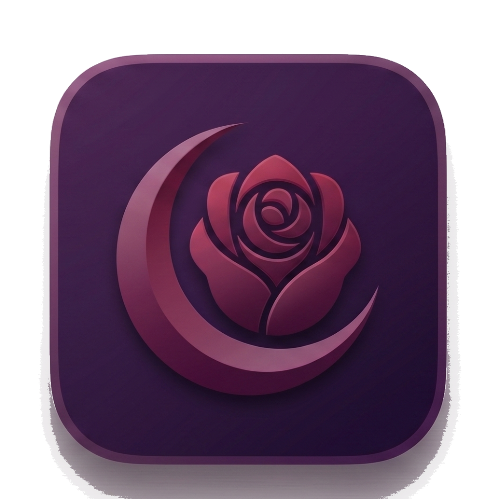

# Rose Ly

> *Sistem Paparan Masjid Pintar.* A broadcast-quality dashboard for Malaysian mosques — and the design system behind it.

<br>



<br>

---

## The product, in one paragraph

Rose Ly is a **TV display + mobile remote** for mosques. The dashboard, mounted on a TV in the prayer hall, shows live waktu solat (prayer times), the Hijri date, a living atmospheric sky, rotating hadith, weather, world clocks, and announcement slides. When prayer time arrives, the screen quiets — and transitions cinematically through *Pre-Azan → Azan → Iqamah → Solat → Khutbah* with full-screen countdowns and Quran audio. From their phone, the imam or *tok siak* configures the mosque, edits slides, controls playback, and previews everything live.

Two screens. One identity. Calm, dignified, and quietly Islamic.

---

## The three colors

|  |  |
|---|---|
| **Aubergine** `#3a1c3a` | The surface. The tile, the wallpaper, the night sky behind the prayer times. |
| **Crimson Rose** `#a8254a` | The voice. Every accent, every active state, every moment that matters. |
| **Petal White** `#fefcfb` | The words. Headlines, prayer names, countdown numerals. |

Everything else — emerald success, amber waiting, sapphire information, purple Friday — supports these three.

---

## The atmosphere

The dashboard never sits on a flat background. A **living sky** ([`RealitySky`](rose-ly/web/src/components/tv/RealitySky.jsx) — a custom WebGL shader) drifts behind every panel: sun and moon orbiting in step with the local time of day, volumetric clouds, a star field that twinkles, occasional shooting stars at night, sea glitter reflecting the sun. Over it sits the **glass furniture**: deeply rounded panels at ~`0.5 black` with hairline borders. And every screen is finished with a soft film grain and edge vignette — invisible to look at directly, but it's what makes the whole thing feel broadcast-quality.

This is the system's signature. Don't replace it with a flat color.

---

## The voice

**Bahasa Melayu first.** English is a fallback. The tone is calm and dignified during prayer context, short and brutal in admin chrome.

> "Azan akan berkumandang, sila senyap."
>
> "Sila penuhkan saf dihadapan dahulu."
>
> "Matikan bunyi telefon bimbit."

Never casual on a prayer-context screen. No exclamation marks on the TV.

In admin: punctual sentence fragments, UPPERCASE, wide letter-spacing. `FASA SOLAT`, `KAWALAN SLAID`, `TETAPAN`, `KANDUNGAN`.

Emoji appears in admin tooling — phase chips (⏳ 🕌 🙏 🤲 📖), feature toggles (📰 🌍 🔔 🎵), weather glyphs. Never on the TV display copy itself.

---

## The typography

**Outfit** is the family. From the 100 weight through the 900, with **black 900** as the workhorse — almost every UI element ships in 900. Regular weight is reserved for hadith body text and announcement slide content. Numbers use `tabular-nums` everywhere.

**Cairo** is loaded for occasional Arabic excerpts. **JetBrains Mono** is on standby for technical readouts but rarely used — most "monospace-feeling" timestamps are actually Outfit Black with tabular numerals.

Tracking is unusually tight (`-0.025em`) on display headlines and unusually wide (`0.3em`–`0.6em`) on micro labels. There's no in-between.

---

## The iconography

A single set of inline stroke icons, drawn in the heroicons style at `strokeWidth=2.25` with rounded ends. No icon font, no SVG sprite library — every icon is hand-placed JSX. The dashboard never has to shout.

For weather, the system uses emoji glyphs — large enough that they read at TV viewing distance, and their warmth complements the sky behind.

---

## Index

```
README.md                  ← this file
SKILL.md                   ← Agent SKill entry-point for Claude Code
colors_and_type.css        ← design tokens (CSS variables + utility classes)
assets/
  logo-mark.png            ← the app icon — aubergine tile, rose & crescent, 1024×1024 transparent
  favicon.png              ← 256×256 version for browser tab
  hero.png                 ← generic hero image from the codebase
  Menjelang_Azan.mp3       ← pre-Azan vocal cue audio
preview/                   ← small cards rendered in the Design System tab
ui_kits/
  tv-display/              ← the 1920×1080 kiosk recreation
    index.html             ← interactive demo
    Sky.jsx                ← real WebGL RealitySky shader (ported 1:1)
    TVHeader, PrayerSidebar, MainStage, NewsTicker, PhaseOverlay …
  mobile-admin/            ← the phone-first remote/config recreation
    index.html             ← interactive demo
    AdminShell, RemoteTab, KandunganTab, TetapanTab, LivePreview …
```

---

## Source materials

This system was distilled from the production codebase (`rose-ly/`), with particular focus on:

- `web/src/components/tv/TVDisplay.jsx` — the kiosk
- `web/src/components/tv/RealitySky.jsx` — the WebGL sky
- `web/src/components/admin/MobileAdmin.jsx` — the admin shell + tab nav
- `web/src/components/SetupWizard.jsx` — the first-run wizard
- `web/src/components/tv/Overlays.jsx` — prayer-phase full-screen overlays
- `web/src/constants/index.js` — themes, translations, prayer zones
- `web/src/index.css` — global tokens, glass panel, finishing layers
